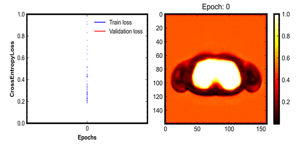

# Team Challenge - Medical Image Analysis

This repository contains a PyTorch implementation used for the Team Challenge project 2023-2024, hosted by University of Technology Eindhoven and University Utrecht. The objective is to quantify the chest volume and/or spinal length in MR images. To this end, we perform voxel-wise semantic segmentation of the *spine* and the *chest volume*, adhering to our definitions. Our method applies the 3D U-Net on provided MRI data from the ScoliStorm project. The predicted segmentations are then used to quantify the volume and length. The workflow and usage of our method is described below. 
## Group 2

* Romy Buijs
* Lisa Cornelissen
* Dimo Devetzis
* Daniel Le
* Jiaxin Zhang

## Quick usage


## Table of contents
* [Description](#team-challenge---medical-image-analysis)
* [Dependencies](#dependencies)
* [Folder Structure](#folder-structure)
* [Workflow](#workflow)
    * [Config file](#config-file)
    * [Dataset and annotation process](#dataset-and-annotation)
    * [Data preprocessing, augmentation and splitting](#data-preprocessing-augmentation-and-splitting)
    * [3D U-net architecture](#3d-u-net-architecture)
    * [Training](#training)
        * [Model weights](#model-weights)
    * [Model output](#model-output)
    * [Model testing](#model-testing)
        * [Qualitative results](#qualitative-results)
        * [Quantitative results](#quantitative-results)
    * [Postprocessing](#postprocessing)
        * [Chest volume](#chest-volume)
        * [Spinal length](#spinal-length)


## Dependencies

* Python==3.10.9 (may work with other versions)
* matplotlib==3.8.2
* monai==1.3.0
* numpy==1.25.2
* pandas==2.2.1
* pynrrd==1.0.0
* scipy==1.12.0
* slicerio==0.1.8
* torch==2.0.1+cu117
* torchvision==0.15.2+cu117
* tqdm==4.66.2
```bash
pip install -r requirements.txt
```
## Folder Structure
```
SegmentationMRI/
├───config.json - holds configuration preprocessing, training, validation and testing
├───main.py - main script to run training, validation and testing
├───postprocessing.py - contains class for volume and spinal length calculation
├───train.py - class for training (, validation and testing)
│
├───data/ - folder for .nrrd and .seg.nrrd data files 
|   ├── EBSx/ - contains scans children 8 - 10
|   └── Volunteer X/ - contains scans volunteers
│
├───dataloader/ - code concerning dataloading 
│   └── datasets.py - class for loading and preprocessing of data
│
├───logger/ - logger for training
│   └── logger.py
│
├───model/ - model used for training
│   └── UNet3D.py
│
├───saved/ - log files and plots for visualization
│
└───utils/ - utility methods 
    ├── transforms.py - class for geometric transformations
    └── utils.py - contains visualization and config loading methods
```

## Workflow

### Config file 
The config file is in `.json` file format and contains parameters used for data preprocessing, training and testing.

```JSON
{
    "dataloader": {
        "data_dir": "data/",                // path to .nrrd directory
        "normalize": false,                 // boolean value for normalization
        "extension": ".nrrd",               // extension of data files
        "LP_dimension": 160,                // dimension after resample in LP
        "S_dimension": 16,                  // dimension after resample in S
        "rotation_angle": 10                // rotation angle, set to 0 for no aug
    },
        
    "trainer": {    
        "batch_size": 1,                    // batch size
        "device": "cuda",                   // selected device for training
        "epochs": 100,                      // number of epochs 
        "lr": 0.0005,                       // learning rate
        "loss_fn": "CrossEntropyLoss"       // loss function used for training
    },

    "tester": {
        "batch_size": 1,                    // batch size
        "device": "cuda"                    // selected device for testing
    }
}
```

### Dataset and annotation
Describe dataset. Modality and T2 weighted etc. Gaps. Patient info. Source. Physical spacings. Dimensions.
Annotation anatomical boundaries (our definition). Mention 3D slicer.
### Data preprocessing, augmentation and splitting
Normaliztion or not?

Since we only have MRI data for 38 patients, we use the Scipy package for data augmentation.  We implement a small geometric transformation--a random rotation in the range of -10 to 10 degree (same angle for the originial image and the mask). After augmentation, we get a dataset that is twice the size of the original dataset, half of which is the original dataset and the other half rotated by a random angle. 

The ratio of splitting the data into train/val/test set is [0.6:0.1:0.3]. 

Since the structure of unet will reduce the size of each dimension of the image by a multiple of 2, we resampled the depth of the original MRI image to 16. To save GPU memory, we also resample the image's width and height from 640 to 160/320. Considering we need to calculate the volume and spinal length later, we calculated and recorded the new spacing information after resampling based on the original pysical spacings.

### 3D U-net architecture

Describe 3D Unet encoding decoding path
### Training
Training parameters. Epochs. Loss function. 

#### Model weights
Weights loading
### Model output
Logits to heatmap
### Model testing
#### Qualitative results
Visualization of data (show images low score and high score)
#### Quantitative results

|Filename	|Volume [mm^3]|	Volume [L]|	DSC↑|	HD↓	|HD95↓|	FPR|
|-------------- | -------------- | -------------- | -------------- | -------------- | -------------- | -------------- | 
|  EBS_1 | 2819175 | 2.82 | 0.87 | 25.622 | 25.5 | 0.0 |
| Volunteer 6 | 6825093 | 6.83 | 0.987 | 18.75 | 1.875 | 0.002 | 
| EBS19 | 2647950 | 2.65 | 0.983 | 5.0 | 2.5 | 0.0 | 
| EBS14 | 2789100 | 2.79 | 0.973 | 25.5 | 2.5 | 0.001 | 
| Volunteer 10 | 8782300 | 8.78 | 0.986 | 27.188 | 1.875 | 0.005 | 
| Volunteer 11 | 5715370 | 5.72 | 0.991 | 5.303 | 0.0 | 0.001 | 
| EBS_6 | 1684375 | 1.68 | 0.94 | 25.5 | 25.5 | 0.0 | 
| EBS15 | 2524050 | 2.52 | 0.958 | 25.5 | 25.5 | 0.002 | 
| EBS12 | 3180375  | 3.18 | 0.903 | 25.986 | 25.5 | 0.008 | 
| Volunteer 28 | 4697850 | 4.7 | 0.99 | 7.071 | 0.0 | 0.001 | 
| EBS_5 | 1939074 | 1.94 | 0.942 | 25.5 | 25.5 | 0.0 |

### Postprocessing
#### Chest volume
Describe calculations
#### Spinal length
Describe calculations
